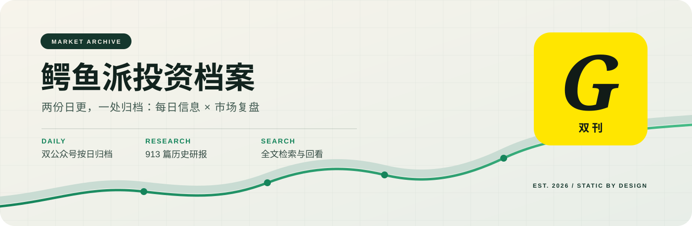

<p align="center">
  
</p>

<h1 align="center">获得信息差</h1>

<p align="center">
  <strong>来自一线机构与公开渠道的市场信息，按日整理，原文直达。</strong>
  <br />
  让值得保存的内容离开信息流，重新成为可以检索、回看和沉淀的资料。
</p>

<p align="center">
  <a href="https://gator.ronchy2000.top/"></a>
  <a href="https://github.com/Ronchy2000/Gator-Investment-Research/actions/workflows/wechat-sync.yml"></a>
  
  
  <a href="./LICENSE"></a>
</p>

<p align="center">
  <a href="https://gator.ronchy2000.top/"><strong>进入资料库</strong></a>
  ·
  <a href="https://gator.ronchy2000.top/archive/">公众号归档</a>
  ·
  <a href="https://gator.ronchy2000.top/reports/">历史研报</a>
  ·
  <a href="https://gator.ronchy2000.top/rss.xml">RSS</a>
  ·
  <a href="https://gator0.ronchy2000.top/">旧版站点</a>
</p>

---

## 关于这个项目

市场从不缺信息，缺的是整理、检索与再次阅读。

**获得信息差**是一个面向长期阅读的静态资料库。它持续归档“获得信息差”微信公众号自 `2026-06-15` 起发布的内容，同时保留旧站积累的 **913 篇公开研报**。文章按日期进入档案，正文和图片随站点一同保存，不必在聊天记录、收藏夹和失效链接之间反复寻找。

这不是一个追求无限信息流的平台。它更像一张安静的书桌：把每天值得留下的内容放好，让搜索、回看和独立判断变得简单。

## 内容版图

| 每日信息归档 | 历史研报资料库 | 独立投资随笔 |
| --- | --- | --- |
| 聚焦“获得信息差”微信公众号，按发布日期持续同步，保留原文入口。 | 收录 913 篇公开研报，覆盖宏观、行业与其他研究主题。 | 保存不属于日常资讯流、但值得长期回看的个人思考与规划。 |
| 支持文字、图文混排与纯图片文章。 | 支持分类、年份筛选和全文检索。 | 独立成篇，不与机构研报混淆。 |

## 为阅读而做

- **按日归档**：从时间线进入内容，而不是被推荐算法决定下一篇读什么。
- **两套资料库统一搜索**：公众号文章与历史研报可以独立筛选，也可以快速定位关键词。
- **原文可追溯**：保留微信公众号原文地址和来源信息，不切断内容上下文。
- **图片本地保存**：封面与正文媒体随文章归档，降低远程图片失效对阅读的影响。
- **轻量而完整**：明暗主题、阅读时间、前后文章、图片放大、RSS 与 sitemap 一应俱全。
- **静态优先**：每篇文章构建为真实 HTML，页面打开快，内容不依赖客户端接口临时加载。

## 它如何运转

```text
微信公众号公开内容
        ↓
每日增量归档与媒体本地化
        ↓
GitHub 保存 Markdown、索引与图片
        ↓
Astro 生成静态页面
        ↓
Cloudflare Pages 自动发布
```

自动化只关注一个公众号。新文章成功入库后才会进入生产站；下载失败的内容会保留到下一次重试，纯图片文章也必须确认图片完整后才算归档完成。

## 项目文档

README 只负责介绍项目。实现、部署与运维细节分别放在以下文档中：

| 文档 | 内容 |
| --- | --- |
| [DEVELOPMENT.md](DEVELOPMENT.md) | 本地开发、构建命令、目录结构与分支约定 |
| [ARCHITECTURE.md](ARCHITECTURE.md) | 数据流、同步器、内容模型与前端架构 |
| [AUTOMATION.md](AUTOMATION.md) | 扫码登录、GitHub Secrets、每日 Action 与故障处理 |
| [DEPLOYMENT.md](DEPLOYMENT.md) | Cloudflare Pages、生产分支、自定义域名与部署排查 |
| [wechat_sync/README.md](wechat_sync/README.md) | 微信公众号同步器的参数与行为 |
| [CHANGELOG.md](CHANGELOG.md) | 主要版本与迁移记录 |

## 致谢

公众号同步能力参考并受益于 [x554960766/wechat-mp-tools](https://github.com/x554960766/wechat-mp-tools)。本项目的微信读书扫码登录协议、公众号文章列表接口与下载流程以该项目的开源实现为重要基础，在此向作者 **xuyi** 表示感谢。

本仓库在此基础上实现了面向单一公众号的持久化增量索引、失败重试、正文与媒体完整性保护、Astro 内容归档及 GitHub Actions 自动发布。具体参考版本、提交与 MIT 许可证全文见 [THIRD_PARTY_NOTICES.md](THIRD_PARTY_NOTICES.md)。

同时感谢 [Astro](https://astro.build/)、[Cloudflare Pages](https://pages.cloudflare.com/) 与 GitHub Actions 提供的开放工具和基础设施。

## 说明

本站仅用于公开信息整理、学习和阅读，不构成任何投资建议。文章版权归原作者所有；投资有风险，请独立判断并承担相应责任。

项目代码采用 [MIT License](LICENSE)。旧版 Docsify 站点继续以只读形式保存在 [`legacy/docsify-archive`](https://github.com/Ronchy2000/Gator-Investment-Research/tree/legacy/docsify-archive) 分支，并部署于 [gator0.ronchy2000.top](https://gator0.ronchy2000.top/)。
