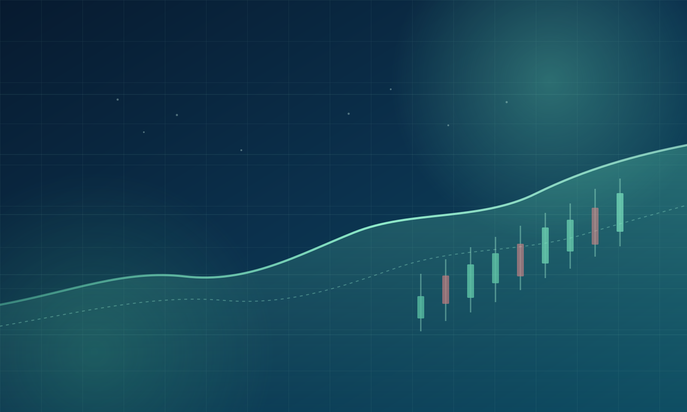

<!-- Logo -->

  

# 🐊 鳄鱼派投资研报

> 来自一线机构的公开研报，按日整理，原文直达

- 📊 每天同步券商/研究机构发布的研报
- 🏢 覆盖宏观与行业洞察，按日期归档
- 🔍 分类与全文搜索，快速定位想看的报告
- 📈 真实数据呈现，不做 AI 生成或润色

 

    👀 本站总访问量： 次

    | 🚴 本站总访客数： 人

 

<!-- GitHub徽章 -->

 

 

[GitHub](https://github.com/Ronchy2000/Gator-Investment-Research)
[开始阅读](./HOME)

<!-- 背景图片 -->

